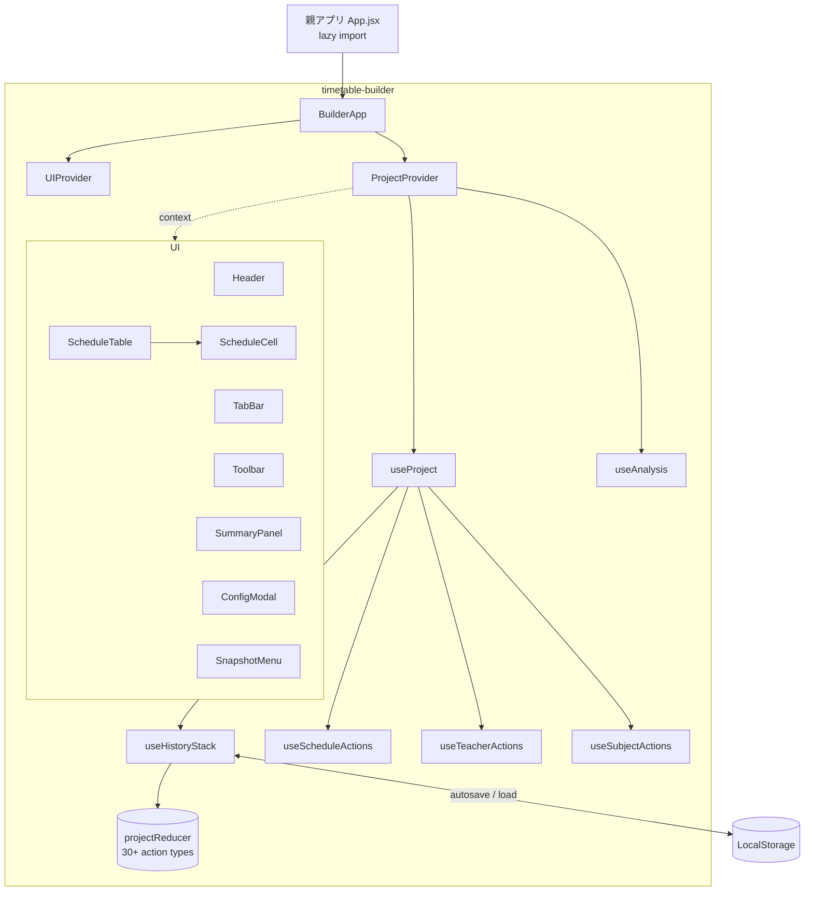
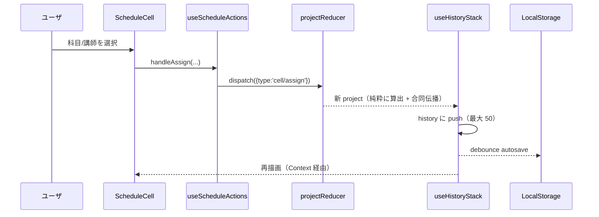
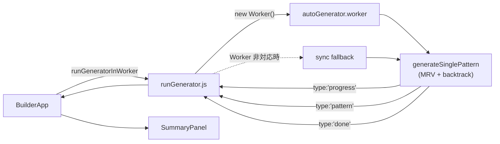

# 講習時間割作成 (timetable-builder) アーキテクチャ

開発者向けの構造ドキュメント。完成度の経緯・今後の課題は [`../ROADMAP.md`](../ROADMAP.md)、
ユーザ操作は [`USER_GUIDE.md`](./USER_GUIDE.md) を参照。

---

## 1. 全体像

親アプリ (`genyakubu-manager`) のサイドバーから lazy import される独立モジュール。
状態は `useReducer` ＋ Context、自動生成は Web Worker、永続化は LocalStorage。



### データフロー（編集 1 操作）



---

## 2. ディレクトリと責務

| パス | 責務 |
|---|---|
| `BuilderApp.jsx` | ルート。Provider 構成、自動生成の起動/キャンセル、容量監視・複数タブ検出 |
| `contexts/` | `ProjectContext` / `UIContext`（value は memo 化して再描画を抑制） |
| `hooks/projectReducer.js` | 純粋 reducer。30+ action types を 1 箇所に集約 |
| `hooks/useHistoryStack.js` | reducer ＋ Undo/Redo（最大 50）＋ debounce autosave |
| `hooks/useProject.js` | composer。各アクションフックと派生 callback を束ねる |
| `hooks/use*Actions.js` | dispatch ラッパ（schedule / teacher / subject） |
| `hooks/useAnalysis.js` | 進捗・違反・infeasibility・修正提案を 5 段 useMemo で算出 |
| `hooks/useFocusTrap.js` / `useLongPress.js` / `useTabPresence.js` | a11y・タッチ・複数タブ検出 |
| `logic/autoGenerator.js` | 純粋ソルバ（MRV ＋ バックトラック）。`generateSinglePattern` |
| `logic/autoGenerator.worker.js` / `runGenerator.js` | Worker エントリ ＋ ラッパ（非対応環境は sync fallback） |
| `logic/constraints/` | 講師・スケジュール制約の純粋関数群 |
| `utils/scheduleKey.js` | `d{n}-p{n}-c{n}` の ID ベースキーと v1→v3 マイグレーション |
| `utils/combinedPropagation.js` | 合同グループのセル伝播・cascade cleanup |
| `utils/analysisHelpers.js` / `fixSuggestions.js` / `patternLoad.js` | 集計・修正提案・負荷偏りの純粋関数 |
| `utils/csvImport.js` / `templates.js` / `projectSchema.js` / `scheduleDiff.js` / `storageHealth.js` / `tabPresence.js` / `contrast.js` | 各機能の純粋ロジック |
| `utils/excelExport.js` | exceljs で xlsx 出力（動的 import） |

---

## 3. 自動生成パイプライン



- **制約**: `logic/constraints/` の純粋関数（NG・クォータ・重複・1日上限・連続コマ）。
- **部分解**: 完全解が出ないときは最も充填できた状態 (`bestPartial`) を返す。
- **進捗**: 20000 反復ごとに `onProgress` で `{iterations, filledCount, totalSlots}` を間引き通知（E2f）。
- **キャンセル**: Worker は `terminate()`、sync fallback は中断不可（jsdom テストでのみ通る経路）。

---

## 4. データモデル（Project v4）

```
Project {
  version: 4
  name, createdAt, updatedAt
  activeTabId
  dates[], periods[]          // v4: 全タブ共通の講習カレンダー (project レベル)
                              //   dates/periods は全学年の和集合「プール」(NG はこの全日・全時限に設定可)
  tabs: [{ id, name, config: { classes[], subjectCounts, activeDateIds?, activePeriodIds? }, schedule }]
                              //   activeDateIds/activePeriodIds: そのタブが使う日・時限 (未指定=全て)
  teachers: [{ name, subjects[], ngSlots[], ngClasses[], priorityClasses[] }]
  combinedGroups[]            // 合同授業（ラベル参照）
  externalCounts / externalSessions   // 他学年セッション
  subjects[], subjectColors
  snapshots: [{ id, name, tabId, createdAt, schedule }]
  // 生成パラメータ: numPatterns / maxDailyHours / maxIterations / maxConsecutivePeriods
}
```

- `dates/periods/classes` は `{ id, label }`。schedule キーは **ID ベース**（並び替えでズレない）。
- **v4: `dates` / `periods` は project 共通**（全タブが同じ講習カレンダーを参照）。
  `classes` / `subjectCounts` は引き続きタブ（学年）ごと。これにより講師不在・NG
  （`teacher.ngSlots`、ラベルベースでもともと全タブ共通）が全タブで噛み合う。
  - **`dates` / `periods` は全学年の和集合「プール」**。各タブは `config.activeDateIds` /
    `config.activePeriodIds`（未指定=全日・全時限）で「この学年が実際に使う日・時限」を
    選ぶ（学年で期間や時間帯がズレても・歯抜けがあってもOK。例: 中３=昼の時限のみ、
    中１・２=夜の時限のみ、を同じ時限プールから選ぶ）。`activeDatesForTab(pool, tab)` /
    `activePeriodsForTab(pool, tab)` が subset を返す（`scheduleKey.js`、E-3 で periods 版を追加）。
  - 読み取り側は `useProject` の `currentConfig`（= `tab.config` に**そのタブの使う日・使う時限**
    をマージした派生ビュー）経由で無改修。時間割 / 自動生成 / 分析 / Excel は各タブの使う日・
    時限だけを対象にする。**NG パネルだけはプール全日・全時限**（`project.dates` /
    `project.periods` を直接参照、`currentConfig` は経由しない）を使い、どのタブからでも
    全日・全時限に不在・NG を設定できる（例: 中３の昼タブから中１・２専用の夜の時限にも
    NG を設定できる必要がある）。
  - 書き込み: 日付プール+使う日は `tabDates/setByLabels`（手動/自動生成）・`tabDates/toggle`・
    `tabDates/setAllActive`・`dates/removeFromPool`。時限プール+使う時限は
    `config/setList('periods')`（プールのテキストエリア編集。削除時は全タブの
    `activePeriodIds` から該当 id も cascade 除去）・`tabPeriods/toggle`・
    `tabPeriods/setAllActive`（periods には自動生成が無く手打ちの短いリストなので
    `tabDates/setByLabels` 相当は無い）。`classes` はタブ単位。日付の自動生成は
    `utils/dateGenerate.js`（期間+曜日+除外日→ラベル、純粋関数）。手動追加も日付ピッカー
    経由で同じ `dateToLabel`/`ymdToLabel` を通すため、ラベルは常に `M/D(曜)` 形式で揺れない
    （文字列完全一致でプール重複判定しているため、表記揺れ=重複データの原因になる。
    時限ラベルはフリーテキストのままなので、同じラベル文字列を昼夜で使い回すと
    ラベルベースの NG キー (`makeNgKey`) が衝突する — 区別したい場合は
    「1限(昼)」「1限(夜)」のようにラベル自体を分けて運用する）。
  - `BasicSettings` の日付チェックリストは `sortPoolDatesByCalendar`（`dateGenerate.js`、
    表示専用の純粋関数）で常に実日付順に並べ替えて表示する（保存順序=挿入順は変更しない）。
    時限チェックリストはプール順表示（時限は手打ちの短いリストで自動生成が無いため、
    日付のような並べ替えは行わない）。日付・時限とも「🗂 全タブまとめて表示」トグルで、
    行=プールの日付/時限・列=各タブのマトリクス表示に切り替え、他タブの分も
    `handleToggleTabDate`/`handleToggleTabPeriod`・`handleSetAllTabDates`/`handleSetAllTabPeriods`
    (いずれも `tabId` 省略時はアクティブタブ) で直接編集できる。2 つのトグルボタンが同時に
    画面上に存在するため、ボタン文言は「日付を全タブまとめて表示」「時限を全タブまとめて表示」
    と明示的に区別している（どちらも同じ絵文字・文言だとどちらのトグルか判別できないため）。
- NG・合同・externalCounts は **ラベルベース**（JSON 可読性・タブ間共有のため。cascade cleanup で整合を維持）。
- マイグレーション: `migrateProject` が v1→v2→v3→v4 を順次合成。v3→v4 は各タブの
  `dates`/`periods` を**ラベル union** で 1 つに統合し、schedule / snapshot のキーを
  旧タブ ID→ラベル→新 project ID で remap する。読込時に `validateProjectShape` で
  致命的な型崩れを弾く。

### 4.1 スキーマ version を上げるときのルール（E5g: v5 以降の migration path）

v1→v4 の migration 実装で確立したパターンを、次に version を上げる人
（v5: combinedGroups の ID 化 / teacher 安定 ID 等が候補）向けにルール化する。

1. **1 リリース 1 インクリメント**。version up はリリース（PR）の最後に
   1 度だけ行う。開発途中の中間スキーマに version を割り当てない —
   ユーザの localStorage に中間 version が保存されると、その形を永久に
   migrate し続ける羽目になる。
2. **順次関数合成**。`migrateProject`（`utils/scheduleKey.js`）は
   `if (version < n)` ガード付きの v(n-1)→v(n) 変換を上から順に適用する
   チェーン。v5 を足すときは `migrateProjectV4toV5(project)` を純粋関数で
   新設し、チェーン末尾に 1 ブロック追加する。**既存の migration 関数には
   手を入れない**（過去 version の解釈は凍結。直すのはバグのみ — 例: F5f）。
3. **reject より正規化**（F.5 系統 A の方針）。`validateProjectShape` は
   「tabs / config / schedule の致命的な構造崩れ」だけを見て reject し、
   フィールドレベルの型崩れは migrate 側で既定値に落として救う。reject は
   フォールバック（= ユーザデータ喪失）に直結するため増やさない。
   新フィールドは「無ければ / 型が合わなければ default 補完」を
   `migrateProject` 末尾の正規化ブロックに足す — 補完だけなら version を
   上げなくてよい（`snapshots` や生成パラメータがこの方式）。
4. **失敗時の安全網は退避 + フォールバック**（F2f）。migration 関数自身は
   「解釈できないなら throw」でよい。`loadInitialProject` が catch して
   原本を `builder.schedule_project_corrupt` へ退避し、default へ
   フォールバック + toast で退避先を知らせる。migration 内で無理に
   握りつぶさない。
5. **ID 参照を変えるときは「旧 ID → ラベル → 新 ID」の 2 段 remap**
   （v3→v4 方式）。schedule / snapshots のキー、NG・externalCounts の
   ラベルキーなど、参照系をすべて列挙してから設計する（`utils/labelRefs.js`
   にラベルキーのパース知識が集約されている）。キーの数値成分の解釈
   （位置か ID か）は次元の形式で分岐が必要（F5f の教訓）。
6. **テストは 3 点セット**。(a) v(n) fixture → v(n+1) の正常系、
   (b) 型崩れ fixture が既定値に落ちる正規化系、(c)
   `projectLoadIntegrity.test.js` に「validate 通過 JSON は migrate +
   初回利用でクラッシュしない」fixture を追加。旧 version（v1〜v3）の
   fixture テストは削除しない — チェーン全体の回帰検知になっている。
7. **書き込み側も同時に上げる**。`createNewProject`（projectFactory）と
   `migrateProject` の到達 version、`validateProjectShape` の許容形を
   同じ PR で揃える。JSON 出力はそのとき時点の version をそのまま持つので、
   エクスポート専用の変換は作らない。

---

## 5. 守るべき設計上の約束

- **状態統計で UI を自動変形しない**（リポジトリ CLAUDE.md の禁止規約）。
- **印刷は 2 系統**（親 CLAUDE.md）。Builder は `window.print()` 方式。
- **Tailwind は `builder-*` トークン**のみ使用。読めるテキストは WCAG AA（`contrast.test.js` で回帰防止）。
- **純粋関数は `utils/` ＋ `*.test.js`**。reducer も純粋に保ち、副作用（createdAt 付与・autosave）はフック側に置く。

---

## 6. 検証

```bash
npm run lint        # 0 errors / 0 warnings
npm run typecheck   # tsc --noEmit
npm test            # vitest
npm run build       # 警告は excelExport の chunk size のみ（期待動作）
```
