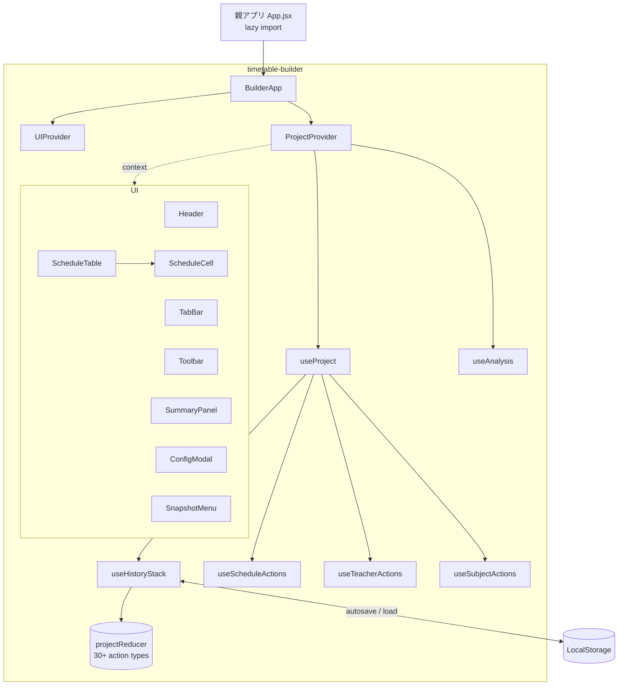
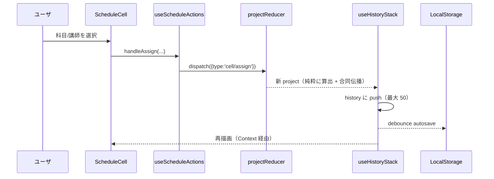
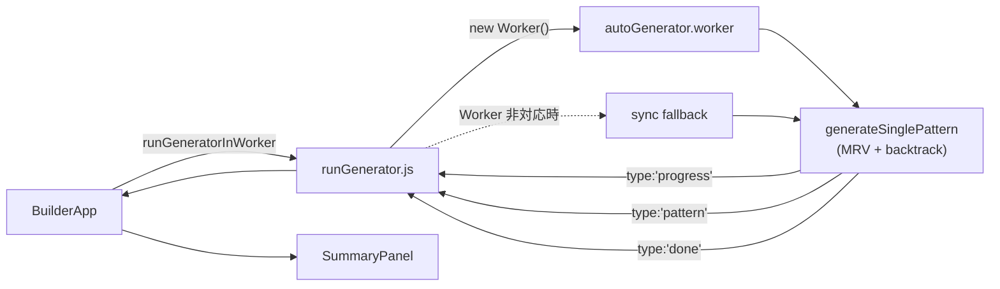

# 講習時間割作成 (timetable-builder) アーキテクチャ

開発者向けの構造ドキュメント。完成度の経緯・今後の課題は [`../ROADMAP.md`](../ROADMAP.md)、
ユーザ操作は [`USER_GUIDE.md`](./USER_GUIDE.md) を参照。

---

## 1. 全体像

親アプリ (`genyakubu-manager`) のサイドバーから lazy import される独立モジュール。
状態は `useReducer` ＋ Context、自動生成は Web Worker、永続化は LocalStorage。



### データフロー（編集 1 操作）



---

## 2. ディレクトリと責務

| パス | 責務 |
|---|---|
| `BuilderApp.jsx` | ルート。Provider 構成、自動生成の起動/キャンセル、容量監視・複数タブ検出 |
| `contexts/` | `ProjectContext` / `UIContext`（value は memo 化して再描画を抑制） |
| `hooks/projectReducer.js` | 純粋 reducer。30+ action types を 1 箇所に集約 |
| `hooks/useHistoryStack.js` | reducer ＋ Undo/Redo（最大 50）＋ debounce autosave |
| `hooks/useProject.js` | composer。各アクションフックと派生 callback を束ねる |
| `hooks/use*Actions.js` | dispatch ラッパ（schedule / teacher / subject） |
| `hooks/useAnalysis.js` | 進捗・違反・infeasibility・修正提案を 5 段 useMemo で算出 |
| `hooks/useFocusTrap.js` / `useLongPress.js` / `useTabPresence.js` | a11y・タッチ・複数タブ検出 |
| `logic/autoGenerator.js` | 純粋ソルバ（MRV ＋ バックトラック）。`generateSinglePattern` |
| `logic/autoGenerator.worker.js` / `runGenerator.js` | Worker エントリ ＋ ラッパ（非対応環境は sync fallback） |
| `logic/constraints/` | 講師・スケジュール制約の純粋関数群 |
| `utils/scheduleKey.js` | `d{n}-p{n}-c{n}` の ID ベースキーと v1→v3 マイグレーション |
| `utils/combinedPropagation.js` | 合同グループのセル伝播・cascade cleanup |
| `utils/analysisHelpers.js` / `fixSuggestions.js` / `patternLoad.js` | 集計・修正提案・負荷偏りの純粋関数 |
| `utils/csvImport.js` / `templates.js` / `projectSchema.js` / `scheduleDiff.js` / `storageHealth.js` / `tabPresence.js` / `contrast.js` | 各機能の純粋ロジック |
| `utils/excelExport.js` | exceljs で xlsx 出力（動的 import） |

---

## 3. 自動生成パイプライン



- **制約**: `logic/constraints/` の純粋関数（NG・クォータ・重複・1日上限・連続コマ）。
- **部分解**: 完全解が出ないときは最も充填できた状態 (`bestPartial`) を返す。
- **進捗**: 20000 反復ごとに `onProgress` で `{iterations, filledCount, totalSlots}` を間引き通知（E2f）。
- **キャンセル**: Worker は `terminate()`、sync fallback は中断不可（jsdom テストでのみ通る経路）。

---

## 4. データモデル（Project v4）

```
Project {
  version: 4
  name, createdAt, updatedAt
  activeTabId
  dates[], periods[]          // v4: 全タブ共通の講習カレンダー (project レベル)
                              //   dates は全学年の和集合「プール」(NG はこの全日に設定可)
  tabs: [{ id, name, config: { classes[], subjectCounts, activeDateIds? }, schedule }]
                              //   activeDateIds: そのタブが使う日 (未指定=全日)
  teachers: [{ name, subjects[], ngSlots[], ngClasses[], priorityClasses[] }]
  combinedGroups[]            // 合同授業（ラベル参照）
  externalCounts / externalSessions   // 他学年セッション
  subjects[], subjectColors
  snapshots: [{ id, name, tabId, createdAt, schedule }]
  // 生成パラメータ: numPatterns / maxDailyHours / maxIterations / maxConsecutivePeriods
}
```

- `dates/periods/classes` は `{ id, label }`。schedule キーは **ID ベース**（並び替えでズレない）。
- **v4: `dates` / `periods` は project 共通**（全タブが同じ講習カレンダーを参照）。
  `classes` / `subjectCounts` は引き続きタブ（学年）ごと。これにより講師不在・NG
  （`teacher.ngSlots`、ラベルベースでもともと全タブ共通）が全タブで噛み合う。
  - **`dates` は全学年の和集合「プール」**。各タブは `config.activeDateIds`（未指定=全日）で
    「この学年が実際に使う日」を選ぶ（学年で期間がズレても・歯抜けの日があってもOK）。
    `activeDatesForTab(pool, tab)` が subset を返す（`scheduleKey.js`）。
  - 読み取り側は `useProject` の `currentConfig`（= `tab.config` に project の `periods` と
    **そのタブの使う日**をマージした派生ビュー）経由で無改修。時間割 / 自動生成 / 分析 /
    Excel は各タブの使う日だけを対象にする。**NG パネルだけはプール全日**
    （`project.dates`）を使い、どのタブからでも全日に不在・NG を設定できる。
  - 書き込み: 日付プール+使う日は `tabDates/setByLabels`（手動/自動生成）・`tabDates/toggle`・
    `tabDates/setAllActive`・`dates/removeFromPool`。`periods` は `config/setList('periods')`
    で project 共通、`classes` はタブ単位。日付の自動生成は `utils/dateGenerate.js`
    （期間+曜日+除外日→ラベル、純粋関数）。手動追加も日付ピッカー経由で同じ
    `dateToLabel`/`ymdToLabel` を通すため、ラベルは常に `M/D(曜)` 形式で揺れない
    （文字列完全一致でプール重複判定しているため、表記揺れ=重複データの原因になる）。
  - `BasicSettings` の日付チェックリストは `sortPoolDatesByCalendar`（`dateGenerate.js`、
    表示専用の純粋関数）で常に実日付順に並べ替えて表示する（保存順序=挿入順は変更しない）。
    「🗂 全タブまとめて表示」トグルで、行=プールの日付・列=各タブのマトリクス表示に切り替え、
    他タブの日付を `handleToggleTabDate(dateId, tabId)` / `handleSetAllTabDates(active, tabId)`
    で直接編集できる（両 handler は元々 tabId 引数を受けるため reducer 変更は不要だった）。
- NG・合同・externalCounts は **ラベルベース**（JSON 可読性・タブ間共有のため。cascade cleanup で整合を維持）。
- マイグレーション: `migrateProject` が v1→v2→v3→v4 を順次合成。v3→v4 は各タブの
  `dates`/`periods` を**ラベル union** で 1 つに統合し、schedule / snapshot のキーを
  旧タブ ID→ラベル→新 project ID で remap する。読込時に `validateProjectShape` で
  致命的な型崩れを弾く。

---

## 5. 守るべき設計上の約束

- **状態統計で UI を自動変形しない**（リポジトリ CLAUDE.md の禁止規約）。
- **印刷は 2 系統**（親 CLAUDE.md）。Builder は `window.print()` 方式。
- **Tailwind は `builder-*` トークン**のみ使用。読めるテキストは WCAG AA（`contrast.test.js` で回帰防止）。
- **純粋関数は `utils/` ＋ `*.test.js`**。reducer も純粋に保ち、副作用（createdAt 付与・autosave）はフック側に置く。

---

## 6. 検証

```bash
npm run lint        # 0 errors / 0 warnings
npm run typecheck   # tsc --noEmit
npm test            # vitest
npm run build       # 警告は excelExport の chunk size のみ（期待動作）
```
